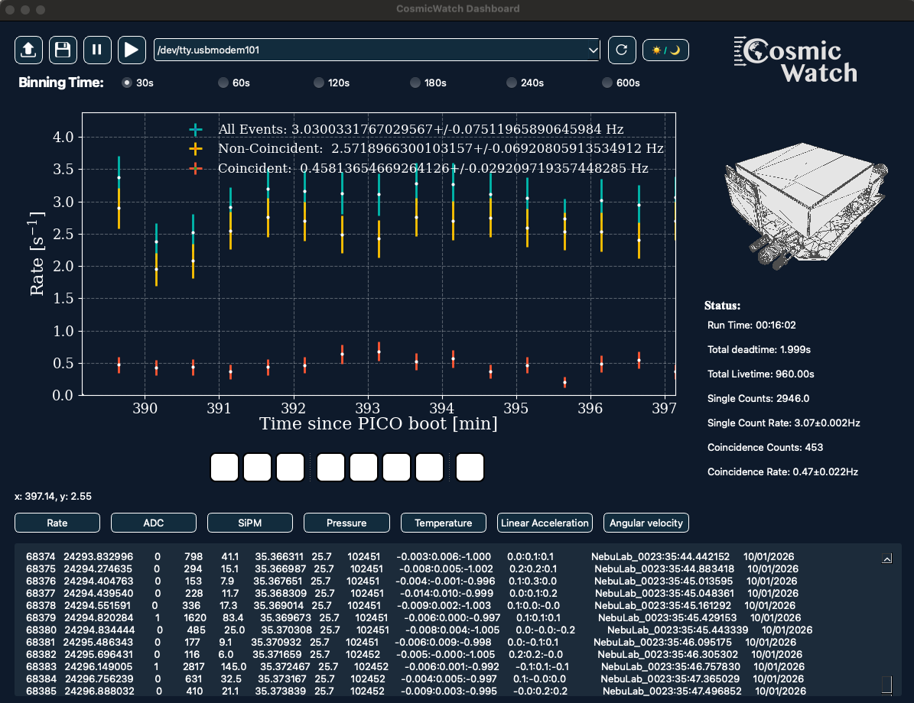

# CosmicWatch GUI



This directory contains the PyQt6-based graphical user interface (GUI) for the CosmicWatch Desktop Muon Detector v3X. The GUI provides real-time data visualization, file loading, and analysis tools for both live and recorded data from the detector.

---

## Modes of Utilization

### 1. **Live Mode (Real-Time Data Acquisition)**
- **Connect** your detector via USB and select the correct serial port from the dropdown.
- Click the **Play** button to start recording live data.
- The GUI will display real-time plots (rate, ADC, SiPM, etc.) and update statistics as data arrives.
- You can pause/resume or stop recording at any time.
- **Time axis**: Shows "Time since boot [min]" (not time since recording started).

### 2. **File Loading Mode**
- Click the **folder** icon to load previously recorded data files (from computer or SD card).
- The GUI will parse and display the data, allowing you to explore all plots and statistics as if the data were live.
- Supports both 13-column (computer-recorded) and 10-column (SD card) file formats.

### 3. **Analysis & Visualization**
- Switch between different plot types using the buttons: **Rate, ADC, SiPM, Pressure, Temperature, Linear Acceleration, Angular Velocity**.
- Adjust the **binning time** (30s, 60s, 120s, etc.) to change the time resolution of the rate plot.
- View event-by-event data in the table at the bottom.
- Export plots as PDF for further analysis or publication.

---

## Key Features
- **Real-time plotting** with PyQt6 and matplotlib
- **Multiple plot types**: Rate, ADC, SiPM, environmental sensors, and more
- **Coincidence analysis**: Plots and statistics for all, non-coincident, and coincident events
- **Status panel**: Live summary of run time, deadtime, count rates, and more
- **File compatibility**: Handles both computer and SD card data formats
- **Dark mode**: Modern, visually appealing interface

---

## Common Gotchas & Troubleshooting

- **Time Axis Confusion**: The time axis shows time since the PICO board was powered on, not time since recording started. This is by design to match the detector's internal clock.
- **No Data Displayed**: If you see no data after starting live mode, ensure the correct serial port is selected and the detector is powered on.
- **Short Runs**: In live mode, the rate plot will only show points after at least one bin duration has elapsed (e.g., 30 seconds for 30s binning).
- **File Format**: Loading files with the wrong number of columns or corrupted data may cause errors. Only use files generated by the CosmicWatch system.

---

## Setup & Requirements

- Python 3.8+
- Install dependencies (from project root):
  ```bash
  pip install -r requirements.txt
  ```
- Run the GUI:
  ```bash
  python GUI/GUI.py
  ```

---

## Screenshot


---

## Credits
- CosmicWatch Project: https://cosmicwatch.lns.mit.edu/
- GUI developed and maintained by the CosmicWatch community

---

## For Developers
- The main application is in `GUI.py` (~2000 lines, PyQt6)
- Uses matplotlib for plotting, numpy for data handling, and pyserial for communication
- See code comments for details on extending or modifying the GUI

---

For more information, see the main project README or documentation files in the root directory.
